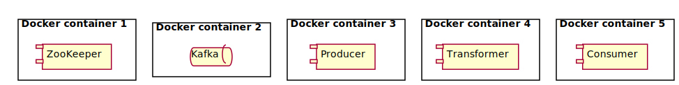

# Introduction

Imagine you have an application that can export events to Kafka and another
application that can consume events from Kafka and you need to integrate them.


Seems simple unless the second application does not understand the data
format of the first one. Well, still simple with Kafka Streams.


This example demonstrates:

* Kafka producer
* Kafka consumer
* Kafka Streams transformer

Since this is simple enough already, example also demonstrates
how to create Docker containers and run all the components using docker-compose
with just single command.



# How to build

This is a multi-project gradle build that will prepare everything. Just run:

```bash
$ ./gradlew build
```

This will:

* Build JSON producer Java application
* Build XML consumer Java application
* Build transformer Java application that uses Kafka Streams
* Build Docker containers for all these applications

In the real world, you'll have producer and consumer already available
or at least built separately. However, you still might want to build
simulators this way if you use them in system testing.

# How to start everything

First, you have to download and install ZooKeeper then download and install Kafka then
install producer, consumer and transformer. Joke!

```bash
$ docker-compose up -d

Creating network "kafka-in-docker_default" with the default driver
Creating kafka-in-docker_transformer_1 ... done
Creating kafka-in-docker_zookeeper_1   ... done
Creating kafka-in-docker_kafka_1       ... done
Creating kafka-in-docker_producer_1    ... done
Creating kafka-in-docker_consumer_1    ... done
```

# How to stop everything

```bash
$ docker-compose down

Stopping kafka-in-docker_zookeeper_1   ... done
Stopping kafka-in-docker_consumer_1    ... done
Stopping kafka-in-docker_producer_1    ... done
Stopping kafka-in-docker_kafka_1       ... done
Stopping kafka-in-docker_transformer_1 ... done
Removing kafka-in-docker_zookeeper_1   ... done
Removing kafka-in-docker_consumer_1    ... done
Removing kafka-in-docker_producer_1    ... done
Removing kafka-in-docker_kafka_1       ... done
Removing kafka-in-docker_transformer_1 ... done
Removing network kafka-in-docker_default
```

# How to see what's going on

```bash
$ docker-compose logs producer

producer_1     | 16:55:42.646 [main] INFO  example.ExampleProducer - Sending message #1
producer_1     | 16:55:46.744 [kafka-producer-network-thread | producer-1] WARN  org.apache.kafka.clients.NetworkClient - [Producer clientId=producer-1] Error while fetching metadata with correlation id 1 : {json-topic=LEADER_NOT_AVAILABLE}
producer_1     | 16:55:46.747 [kafka-producer-network-thread | producer-1] INFO  org.apache.kafka.clients.Metadata - Cluster ID: 0_bi99DQTjGnnfnuCJ1f3g
producer_1     | 16:55:46.872 [kafka-producer-network-thread | producer-1] WARN  org.apache.kafka.clients.NetworkClient - [Producer clientId=producer-1] Error while fetching metadata with correlation id 3 : {json-topic=LEADER_NOT_AVAILABLE}
producer_1     | 16:55:48.011 [main] INFO  example.ExampleProducer - Sending message #2
producer_1     | 16:55:49.012 [main] INFO  example.ExampleProducer - Sending message #3
```

```bash
$ docker-compose logs transformer

transformer_1  | 16:55:47.855 [example-transformer-8b6e0711-cdbd-4bf2-8ac3-1e39dd3bae22-StreamThread-1] INFO  org.apache.kafka.streams.KafkaStreams - stream-client [example-transformer-8b6e0711-cdbd-4bf2-8ac3-1e39dd3bae22] State transition from REBALANCING to RUNNING
transformer_1  | 16:55:47.959 [example-transformer-8b6e0711-cdbd-4bf2-8ac3-1e39dd3bae22-StreamThread-1] INFO  example.ExampleTransformer - Translating {"number":1}
transformer_1  | 16:55:48.013 [kafka-producer-network-thread | example-transformer-8b6e0711-cdbd-4bf2-8ac3-1e39dd3bae22-StreamThread-1-producer] INFO  org.apache.kafka.clients.Metadata - Cluster ID: 0_bi99DQTjGnnfnuCJ1f3g
transformer_1  | 16:55:48.029 [example-transformer-8b6e0711-cdbd-4bf2-8ac3-1e39dd3bae22-StreamThread-1] INFO  example.ExampleTransformer - Translating {"number":2}
transformer_1  | 16:55:49.019 [example-transformer-8b6e0711-cdbd-4bf2-8ac3-1e39dd3bae22-StreamThread-1] INFO  example.ExampleTransformer - Translating {"number":3}
```

```bash
$ docker-compose logs consumer

consumer_1     | 16:55:47.723 [main] INFO  org.apache.kafka.clients.consumer.internals.AbstractCoordinator - [Consumer clientId=consumer-1, groupId=test-group] (Re-)joining group
consumer_1     | 16:55:47.770 [main] INFO  org.apache.kafka.clients.consumer.internals.AbstractCoordinator - [Consumer clientId=consumer-1, groupId=test-group] Successfully joined group with generation 1
consumer_1     | 16:55:47.772 [main] INFO  org.apache.kafka.clients.consumer.internals.ConsumerCoordinator - [Consumer clientId=consumer-1, groupId=test-group] Setting newly assigned partitions [xml-topic-0]
consumer_1     | 16:55:47.796 [main] INFO  org.apache.kafka.clients.consumer.internals.Fetcher - [Consumer clientId=consumer-1, groupId=test-group] Resetting offset for partition xml-topic-0 to offset 0.
consumer_1     | 16:55:48.184 [main] INFO  example.ExampleConsumer - Received message #1: ConsumerRecord(topic = xml-topic, partition = 0, leaderEpoch = 0, offset = 0, CreateTime = 1552928146986, serialized key size = 1, serialized value size = 21, headers = RecordHeaders(headers = [], isReadOnly = false), key = 1, value = <message value='1' />)
consumer_1     | 16:55:48.185 [main] INFO  example.ExampleConsumer - Received message #2: ConsumerRecord(topic = xml-topic, partition = 0, leaderEpoch = 0, offset = 1, CreateTime = 1552928148011, serialized key size = 1, serialized value size = 21, headers = RecordHeaders(headers = [], isReadOnly = false), key = 2, value = <message value='2' />)
consumer_1     | 16:55:49.125 [main] INFO  example.ExampleConsumer - Received message #3: ConsumerRecord(topic = xml-topic, partition = 0, leaderEpoch = 0, offset = 2, CreateTime = 1552928149013, serialized key size = 1, serialized value size = 21, headers = RecordHeaders(headers = [], isReadOnly = false), key = 3, value = <message value='3' />)
```
